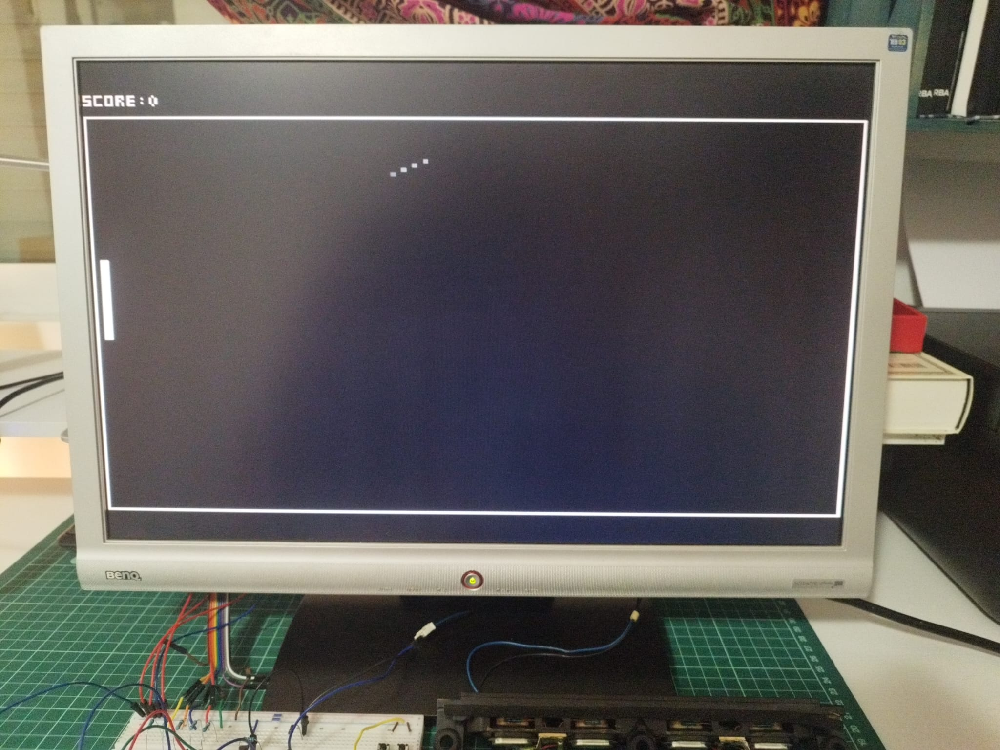
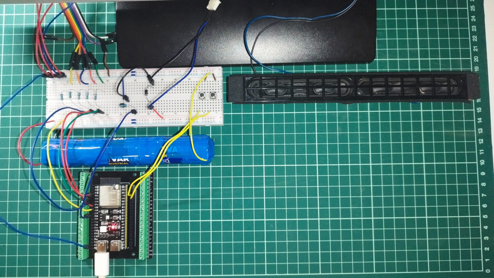

# PingPong ESP32-S3-VGA

A single-player Pong-style game running on an ESP32-S3, rendered directly to a VGA monitor using [bitluni's ESP32-S3-VGA library](https://github.com/bitluni/ESP32S3VGA).

## Demo



[Watch the demo video](docs/demo.mp4) · [Watch on YouTube](https://youtu.be/QY0X-bdAKbE)

## Hardware

- ESP32-S3 N16R8 (16MB Flash / 8MB PSRAM)
- Standard VGA monitor + VGA cable (DE-15 connector)
- 2x push buttons (paddle up / down)
- Passive buzzer or speaker (score/miss sound)
- Resistors: 330Ω (RGB lines), 100Ω (Sync lines)

### Wiring

| ESP32-S3 GPIO | VGA Pin | Signal | Resistor |
|---|---|---|---|
| 4  | 1  | Red     | 330Ω |
| 5  | 2  | Green   | 330Ω |
| 6  | 3  | Blue    | 330Ω |
| 15 | 13 | HSync   | 100Ω |
| 16 | 14 | VSync   | 100Ω |
| —  | 5, 6, 7, 8, 10 | Ground | — |
| 18 | — | Buzzer / audio out | — |
| 1  | — | Button: paddle up (`INPUT_PULLUP`) | — |
| 2  | — | Button: paddle down (`INPUT_PULLUP`) | — |



## Software

- [Arduino IDE](https://www.arduino.cc/en/software) with ESP32 board support installed
- [bitluni's ESP32-S3-VGA library](https://github.com/bitluni/ESP32S3VGA)

## Project structure

```
PingPong/
├── PingPong.ino          Main sketch: setup/loop, board & scoreboard drawing, collision, audio
├── GameContext.h         Shared references (VGA, video mode, playfield margin)
├── ball.h / ball.cpp     Ball class: position, movement, bouncing, drawing
├── paddle.h / paddle.cpp Paddle class: position, movement, drawing
├── player.h / player.cpp Player class: wraps a Paddle + score tracking
├── docs/
│   ├── demo.jpeg         Photo of the game running on a VGA monitor
│   └── wiring.jpeg       Photo of the wiring / circuit
├── README.md
├── LICENSE
└── .gitignore
```

## Building & flashing

1. Install the ESP32 board package in the Arduino IDE and select an ESP32-S3 board profile matching your module (N16R8).
2. Install the ESP32-S3-VGA library (via Library Manager or by cloning it into your `libraries` folder).
3. Wire the board as described above.
4. Open `PingPong.ino`, select the correct board/port, and upload.

## Controls

- Button on GPIO 1: move paddle up
- Button on GPIO 2: move paddle down
- The ball bounces off the top, bottom, and right walls; hitting it with the paddle on the left scores a point and speeds it back; missing it resets the ball to center and resets the score.

## Known limitations

- Single-player only: the "second wall" (right edge) is a plain bounce, not a second paddle.
- Video mode is currently `MODE_320x240x60`; higher resolutions may need adjusted margins/timing depending on your monitor.

## License

MIT — see [LICENSE](LICENSE).
